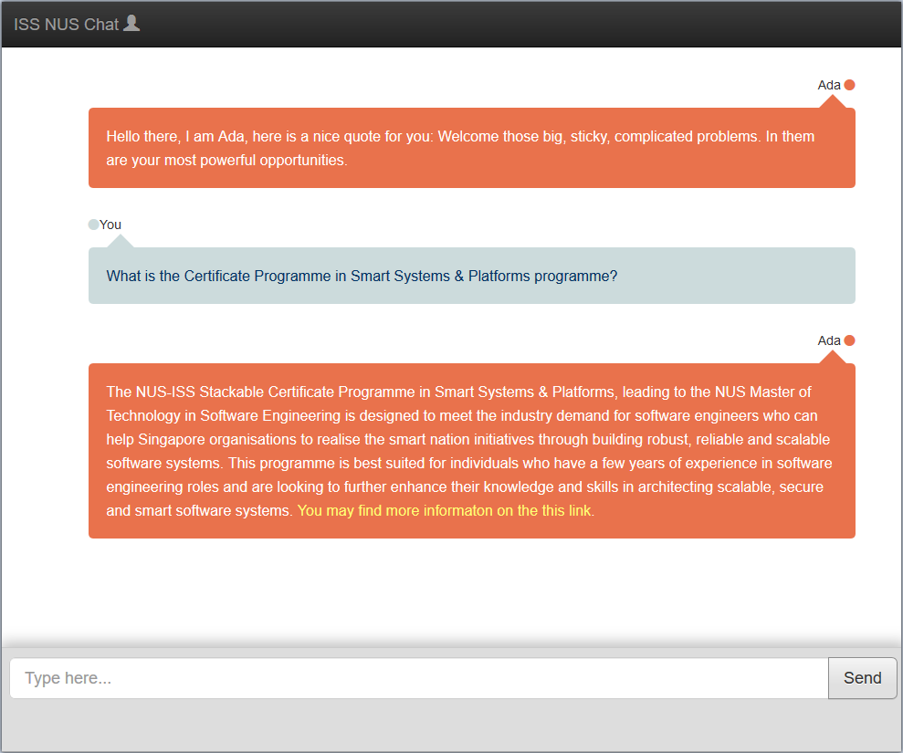

# NUS ISS Chatbot

## Project members of Institute of Systems Science, National University of Singapore:

* Chad Ng
* Jin Xin
* Li Xin
* Dong Bin
* Sun Hang

Here is the description

## REPORT.pdf contains:
* Main report
* User Guide

[View Report](https://github.com/superhell/IRS-RS-2019-05-31-IS1PT-GRP-Xmen-Chatbot/blob/master/ProjectReport/Report.pdf)
 

## Video
[Video Link](https://github.com/superhell/IRS-RS-2019-05-31-IS1PT-GRP-Xmen-Chatbot/blob/master/ProjectReport/video.mp4)

## Development Tools & Environment
### Tools
- **Visual Studio 2017 (Community Edition)**. (https://visualstudio.microsoft.com/) 
- **Google's DialogFlow V2**. (https://developers.google.com/api-client-library/dotnet/apis/dialogflow/v2/)
- **Google.Cloud.Dialogflow.V2**. (https://www.nuget.org/packages/Google.Cloud.Dialogflow.V2/)

### Running Locally
* Make sure you install Visual Studio 2017 (Community Edition)
* Setup an account with Google's DialogFlow v2 and import the agent file located at: Data/ISSNUS.zip
* Import all Intent and Entity files into your DialogFlow agent (Files located at:  Data/)
* Download NGROK from https://ngrok.com/ and setup an account 
* Launch NGROK with the command: ngrok http 5001
* Clone this project, and Launch the backend web hook server located at: SystemCode/ISS NUS Web Hook Server/NHttp.sln
* Ensure you get the Google Credential Json file from the dialog flow service account page and reference it in the chat bot web project code
* Launch chat bot web front end the solution located at: SystemCode/WEB Chat Bot/ISSNUSChatBot.sln

## Please note that internet access is required as the solution will need to connect to Google's dialog flow platform. 

## Credit
[Dialogflow](https://dialogflow.com/)
